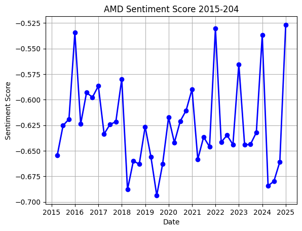
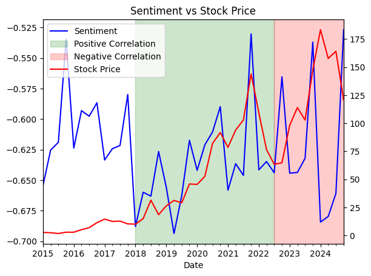

# 🧠 Financial Sentiment Analysis

## 📈 Quantifying Corporate Tone from SEC Filings

This project performs **financial sentiment analysis** on public company filings (10-K and 10-Q reports) from the **U.S. SEC EDGAR database** to evaluate the relationship between **text sentiment** and **stock performance**.  
The pipeline automatically downloads filings, cleans and tokenizes text, applies the **Loughran–McDonald financial dictionary**, and visualizes sentiment trends alongside stock prices.

---

## 🚀 Features

- **Automated SEC Filing Downloader**  
  Uses [`sec-edgar-downloader`](https://pypi.org/project/sec-edgar-downloader/) to fetch 10-K / 10-Q reports for any company (via CIK).

- **Text Extraction & Cleaning**  
  Extracts main filing content between `<TEXT>` tags and removes HTML and noise via BeautifulSoup.

- **Sentiment Scoring**  
  Applies the **Loughran–McDonald Master Dictionary (1993–2024)** to compute:
  - Positive / Negative word counts  
  - Normalized sentiment score  
    ```
    Sentiment = (pos - neg) / (pos + neg)
    ```

- **Visualization**  
  Plots the time-series of sentiment scores vs. stock prices (via `yfinance`).
  


- **Case Study**  
  Example: **AMD (2015–2024)** — filings sentiment correlates positively with stock performance from 2018–2022 and diverges after 2022Q3.

```

**Main dependencies:**
```
sec-edgar-downloader
beautifulsoup4
pandas
matplotlib
yfinance
```

---

## 📊 Usage

### 1. Download filings
```python
from sec_edgar_downloader import Downloader
dl = Downloader('./data', '8@e.com')
dl.get('10-K', '0000002488', after='2015-01-01', before='2024-12-31')
dl.get('10-Q', '0000002488', after='2015-01-01', before='2024-12-31')
```

### 2. Clean & tokenize text
```python
from src.text_cleaner import extract_full_text
text = extract_full_text("data/sec-edgar-filings/...")
```

### 3. Compute sentiment
```python
from src.sentiment_scoring import compute_sentiment
sentiment_df = compute_sentiment("AMD_cleaned_texts.csv")
```

### 4. Visualize correlation
```python
from src.visualization import plot_sentiment_vs_price
plot_sentiment_vs_price(sentiment_df, ticker="AMD")
```

---

## 📈 Output & Insights

Overall, AMD’s sentiment scores remain negative (below -0.5) throughout 2015–2024. While both sentiment and stock price exhibit some co-movement during certain periods, their relationship appears weak before early 2018.

From early 2018 to around Q3 2022, sentiment and stock price tend to move in the same direction, suggesting a positive correlation. However, from Q3 2022 to the end of 2024, their movements are opposite, indicating a negative relationship between sentiment and stock performance during this later period.

| Period | Sentiment Score | Close Price ($) | Comment |
|:-------|----------------:|----------------:|:--------|
| 2015-2017 | ≈ −0.63 | 2 → 10 | Weak correlation |
| 2018-2022 | ↑ improving | 10 → 150 | **Positive correlation** ✅ |
| 2022-2024 | ↓ declining | 150 → 100 | **Negative correlation** ❌ |



---

## 🧩 Future Work

- Extend to **multiple tickers** (e.g., NVDA, AAPL, TSLA)  
- Integrate **transformer-based sentiment models** (FinBERT, Llama-2-Finance)  
- Add **dashboard visualization** (Plotly / Streamlit)  
- Deploy via GitHub Actions for automated updates


